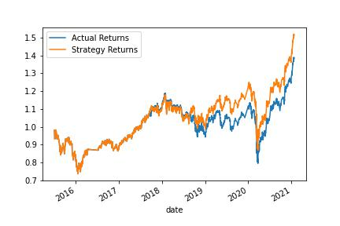

# Algorithmic Trading

I created 4 algorithmic trading models and looked for the one with the best performance. 

## Data
4,323 price observations of the iShares Currency Hedged MSCI Emerging Markets ETF that start in January 2015 and end January 2021. 

Regressors = two moving average prices. 

Independent variable = 1 if the return is >= 0 ; -1 if the return is < 0 

## Baseline Model

Model = support vector machine (SVM) learning method, support vector classification (SVC)

Short moving average window = 4

Long moving average window = 100

Traning = first 3 months of the dataset

The baseline model did pretty well with a return over the test period close to 50%. While the passive strategy (i.e. just holding the asset over the test period) had a return of about 40%. 

 

## Alternative 1

Same as baseline model except:
Traning = first 12 months

In this model all the predicted values are 1 i.e. buy or hold. Thus, the strategy is the same as just holding the asset through the testing period. 

 

## Alternative 2

Same as baseline model except:
Short moving average window = 100
Long moving average window = 500

In this model most of the predicted values were -1 so the strategy comulative returns graph looks very similar to a mirror image of the actual returns.  

 

## Alternative 3

Same as baseline except:
Model =  tree.DecisionTreeClassifier()

In this model most of the predicted values were -1 so the strategy comulative returns graph looks very similar to a mirror image of the actual returns.  

 

## Conclusion

The best performing model is the baseline. 
